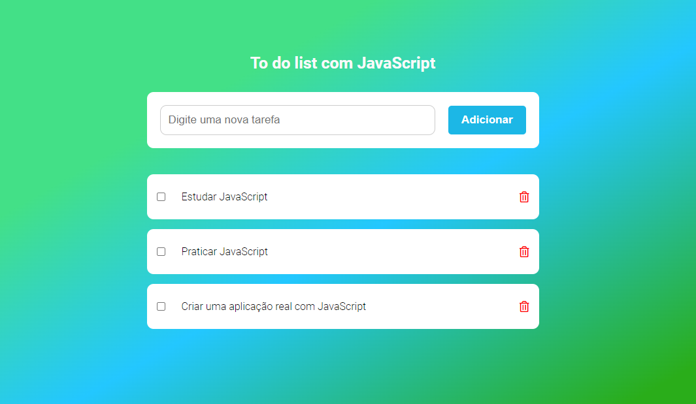

### Sobre o projeto

Projeto To do List responsivo com HTML CSS e JavaScript usando o LocalStorage, com um efeito básico de audio que é disparado quando uma nova tarefa é adicionada na lista.

    

